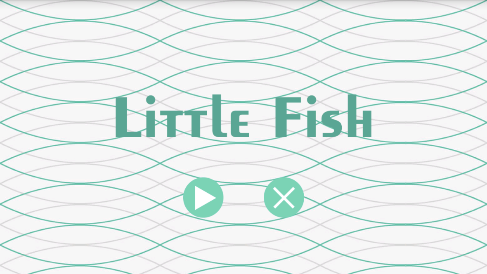
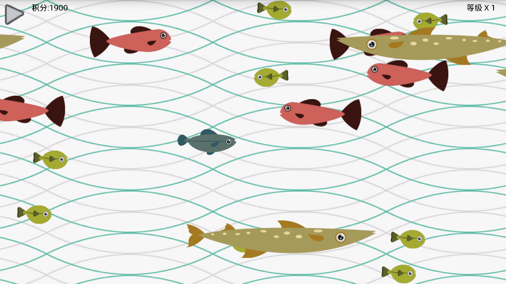
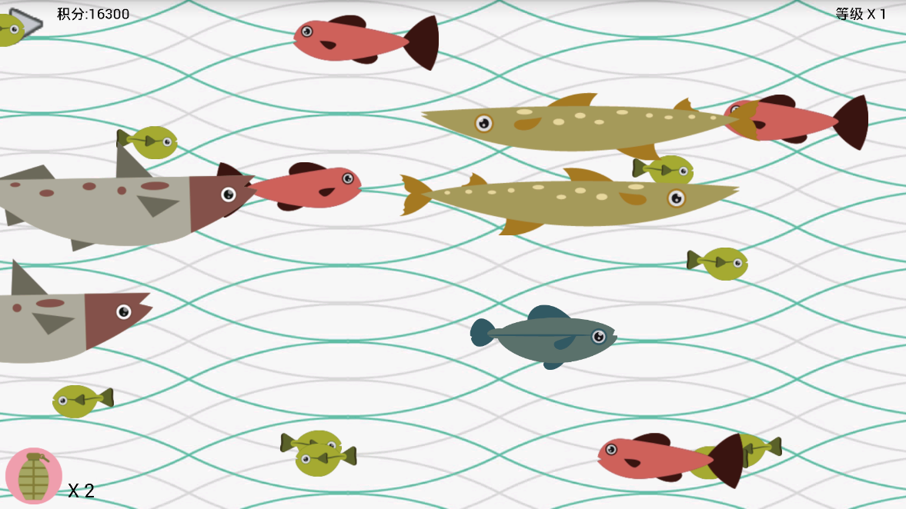
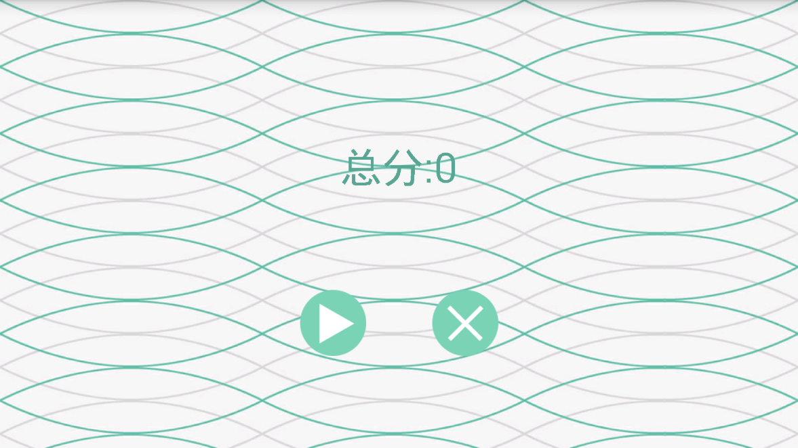

# MyLittleFish
>A simple fish game.

##实现了：

* 游戏启动时默认横屏全屏显示
* 起始界面和结束界面，包含开始按钮和退出按钮
* 连续的背景不断地向左侧滚动
* 鱼随机不断地从两边游出
* 大鱼可以吃小鱼，积分到一定程度鱼会变大
  * 初始鱼为1级大小
  * 到3000分时鱼为2级大小，可以吃红色鱼
  * 到24000分时鱼为3级大小，可以吃黄色鱼
  * 到192000分时鱼为4级大小，可以吃灰色鱼
* 自己的鱼碰到大鱼会GG，进入游戏结束界面并显示积分
* 自己的鱼碰到小鱼会吃掉小鱼，小鱼消失积分增加
* 游戏道具增加了炸弹，道具随机出现。使用道具可以炸光屏幕上所有的鱼
* 音效设置，包括按钮、吃鱼、炸弹、死亡等音效

##应用截图

 
 
 
 
